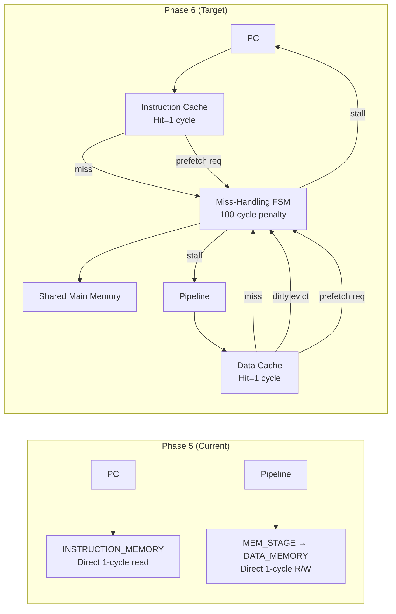
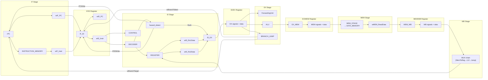
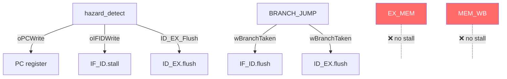
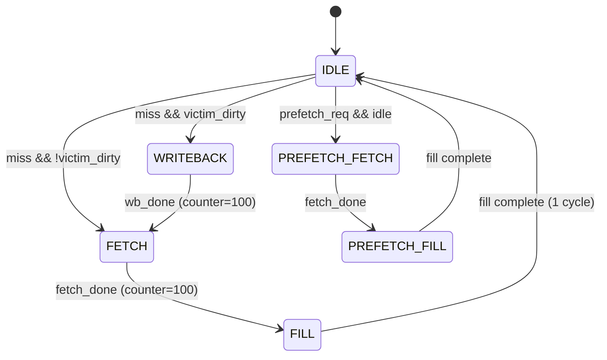
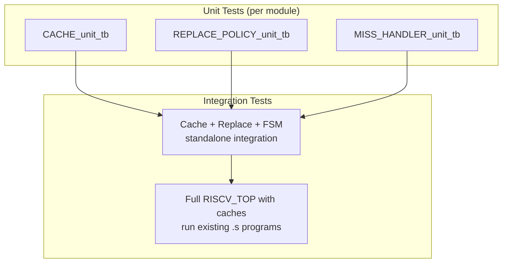

# Phase 6 — Cache Integration: Implementation Plan & Testing Guidelines

> **Project**: RISC-V 5-Stage Pipelined CPU — Cache Integration  
> **Current State**: Phase 5 complete (pipeline + forwarding + hazard detection, direct memory access)  
> **Goal**: Replace direct memory with I-Cache + D-Cache, add miss-handling FSM with 100-cycle penalty, LRU/PLRU, write-back/write-allocate, next-line prefetch

---

## Architecture Overview — Before vs After



---

## Current Phase 5 Architecture — Module Map

The following diagrams show **exactly** what we have right now before any Phase 6 changes.

### Module Hierarchy

```mermaid
graph TD
    TOP["RISCV_TOP"]
    TOP --> IM["INSTRUCTION_MEMORY<br/>(1KB ROM, reads instr.txt)"]
    TOP --> IFID["IF_ID<br/>(stall, flush)"]
    TOP --> DEC["DECODER"]
    TOP --> CTRL["CONTROL"]
    TOP --> REG["REGISTER<br/>(32×32-bit, WB write-back)"]
    TOP --> HAZ["hazard_detect<br/>(load-use stall)"]
    TOP --> IDEX["ID_EX<br/>(stall, flush)"]
    TOP --> FWD["ForwardingUnit<br/>(EX→EX, MEM→EX, MEM→MEM)"]
    TOP --> ALU_C["ALU_CONTROL"]
    TOP --> ALU["ALU"]
    TOP --> BJ["BRANCH_JUMP"]
    TOP --> MUX1["MUX_2_1 (alu_src1)"]
    TOP --> MUX2["MUX_2_1 (alu_src2)"]
    TOP --> EXMEM["EX_MEM<br/>(⚠️ no stall input)"]
    TOP --> MS["MEM_STAGE"]
    MS --> DM["DATA_MEMORY<br/>(4KB, reads data.txt)"]
    TOP --> MEMWB["MEM_WB<br/>(⚠️ no stall input)"]
    TOP --> MUX3["MUX_2_1 (mem_to_reg)"]
    TOP --> MUX4["MUX_2_1 (lui_mux)"]
    TOP --> MUX5["MUX_2_1 (jump_wb_mux)"]

    style EXMEM fill:#ff6b6b,color:#fff
    style MEMWB fill:#ff6b6b,color:#fff
    style IM fill:#4ecdc4,color:#fff
    style MS fill:#4ecdc4,color:#fff
    style DM fill:#4ecdc4,color:#fff
```



> **Red** = Registers that need stall input added for Phase 6  
> **Teal** = Memory modules being replaced by caches

### Pipeline Data Flow



### Control/Stall Signal Flow (Current)



> The red modules above are the gap — Phase 6 requires **all** pipeline registers to freeze during a cache stall.

---

## 🆕 New Files to Create (4 files)

### 1. `CACHE.v` — Cache Core Architecture *(Eren)*

**Purpose**: Parameterizable cache module used for **both** instruction and data caches.

| Parameter | Default | Description |
|-----------|---------|-------------|
| `CACHE_SIZE` | 1024 | Total cache size in bytes |
| `BLOCK_SIZE` | 16 | Block (cache line) size in bytes |
| `ASSOC` | 2 | N-way set associativity |

**Internal Storage**:
- **Tag Array**: `tag[NUM_SETS][ASSOC]` — stores address tags
- **Valid Bits**: `valid[NUM_SETS][ASSOC]` — 1 = entry populated
- **Dirty Bits**: `dirty[NUM_SETS][ASSOC]` — 1 = modified (D-cache only)
- **Data Array**: `data[NUM_SETS][ASSOC][BLOCK_SIZE*8-1:0]` — actual cached data

**Address Decomposition** (32-bit address):
```
| Tag (upper bits) | Set Index (middle) | Block Offset (lower) |
|  31 : idx+off    |  idx+off-1 : off   |    off-1 : 0         |
```
Where `off = log2(BLOCK_SIZE)`, `idx = log2(NUM_SETS)`, `NUM_SETS = CACHE_SIZE / (BLOCK_SIZE * ASSOC)`

**Interface**:
```verilog
module CACHE #(
    parameter CACHE_SIZE = 1024,
    parameter BLOCK_SIZE = 16,
    parameter ASSOC      = 2
) (
    input  wire        iClk,
    input  wire        iRstN,
    // CPU-side request
    input  wire [31:0] iAddress,
    input  wire        iReadEn,
    input  wire        iWriteEn,
    input  wire [31:0] iWriteData,
    input  wire [2:0]  iFunct3,        // byte/half/word select
    // Fill from memory (on miss return)
    input  wire        iFillEn,
    input  wire [BLOCK_SIZE*8-1:0] iFillData,
    input  wire [$clog2(ASSOC)-1:0] iFillWay,  // which way to fill
    // Replacement policy update (from REPLACE_POLICY module)
    input  wire [$clog2(ASSOC)-1:0] iVictimWay,
    // Outputs
    output wire        oHit,
    output wire        oMiss,
    output wire [31:0] oReadData,
    output wire        oDirty,                          // victim is dirty?
    output wire [BLOCK_SIZE*8-1:0] oEvictData,          // dirty block data
    output wire [31:0] oEvictAddr,                      // reconstructed address of evicted block
    output wire [$clog2(ASSOC)-1:0] oHitWay,            // which way hit
    // Exposed for replacement policy
    output wire [ASSOC-1:0] oValidBits,                 // valid bits for accessed set
    output wire [ASSOC-1:0] oDirtyBits                  // dirty bits for accessed set
);
```

**Hit Detection Logic** (combinational):
1. Extract `set_index` and `tag` from `iAddress`
2. For each way `w` in `0..ASSOC-1`: check `valid[set][w] && (tag_array[set][w] == tag)`
3. If any way matches → `oHit = 1`, `oHitWay = w`
4. If no way matches and `(iReadEn || iWriteEn)` → `oMiss = 1`

**Read Logic**: On hit, extract the correct word from the block using `block_offset` and `iFunct3` (byte/half/word + sign extension, mirrors existing `DATA_MEMORY` read logic).

**Write Logic**: On hit + `iWriteEn`, write into the correct word position within the block, set `dirty[set][way] = 1`.

**Fill Logic**: When `iFillEn` is asserted, write `iFillData` into `data[set][iFillWay]`, update `tag`, set `valid = 1`, clear `dirty = 0`.

---

### 2. `REPLACE_POLICY.v` — Replacement, Write Policy & Prefetch *(Kai)*

**Purpose**: LRU/PLRU victim selection, write-back policy helpers, and next-line prefetch request generation.

**Interface**:
```verilog
module REPLACE_POLICY #(
    parameter ASSOC      = 2,
    parameter NUM_SETS   = 32,
    parameter BLOCK_SIZE = 16
) (
    input  wire        iClk,
    input  wire        iRstN,
    // Access info from CACHE
    input  wire [$clog2(NUM_SETS)-1:0] iSetIndex,
    input  wire        iAccessValid,   // a real access happened
    input  wire        iHit,
    input  wire [$clog2(ASSOC)-1:0] iHitWay,
    input  wire [ASSOC-1:0] iValidBits,
    // Victim selection output
    output wire [$clog2(ASSOC)-1:0] oVictimWay,
    // Prefetch
    input  wire [31:0] iAddress,       // current access address
    input  wire        iMiss,          // current access is a miss
    output wire        oPrefetchReq,   // request to prefetch next block
    output wire [31:0] oPrefetchAddr   // address of next sequential block
);
```

**LRU State**: For 2-way, a single bit per set. For 4-way, use pseudo-LRU tree bits.
- On every **hit**, update LRU to mark the accessed way as most-recently-used.
- On every **fill** (after miss), update LRU for the filled way.
- `oVictimWay` = the least-recently-used way (or first invalid way if any `iValidBits[w] == 0`).

**Prefetch Logic**:
- On a **miss** (or optionally on a hit), compute `oPrefetchAddr = iAddress + BLOCK_SIZE` (next sequential block).
- Assert `oPrefetchReq` if the next block is not already being fetched and the FSM is idle.
- Prefetch must **not** evict dirty blocks (or at minimum, must not interfere with demand misses).

---

### 3. `MISS_HANDLER.v` — Miss-Handling FSM & Shared Main Memory *(Orion)*

**Purpose**: Central FSM that coordinates I-cache and D-cache misses, enforces the 100-cycle memory penalty, handles write-back of dirty evicted blocks, and processes prefetch requests.

**FSM States**:


**Interface**:
```verilog
module MISS_HANDLER #(
    parameter BLOCK_SIZE = 16
) (
    input  wire        iClk,
    input  wire        iRstN,
    // I-Cache miss interface
    input  wire        iICacheMiss,
    input  wire [31:0] iICacheMissAddr,
    output wire        oICacheFillEn,
    output wire [BLOCK_SIZE*8-1:0] oICacheFillData,
    // D-Cache miss interface
    input  wire        iDCacheMiss,
    input  wire [31:0] iDCacheMissAddr,
    input  wire        iDCacheDirty,
    input  wire [BLOCK_SIZE*8-1:0] iDCacheEvictData,
    input  wire [31:0] iDCacheEvictAddr,
    output wire        oDCacheFillEn,
    output wire [BLOCK_SIZE*8-1:0] oDCacheFillData,
    // Prefetch interface
    input  wire        iPrefetchReq,
    input  wire [31:0] iPrefetchAddr,
    input  wire        iPrefetchIsICache,  // 1=icache, 0=dcache
    output wire        oPrefetchFillEn,
    output wire [BLOCK_SIZE*8-1:0] oPrefetchFillData,
    // Pipeline stall
    output wire        oStall,      // assert during miss handling
    output wire        oBusy        // FSM not idle
);
```

**Shared Main Memory** (inside this module):
```verilog
reg [7:0] main_memory [0:65535];  // 64KB shared main memory
initial $readmemh("main_mem.txt", main_memory);  // or load instr.txt + data.txt
```

**100-Cycle Penalty**: A counter `rCycleCount` increments each clock. Memory access takes 100 cycles (`rCycleCount == 99` → done).

**Priority**: D-Cache miss > I-Cache miss > Prefetch (demand misses always preempt prefetch).

**Stall Signal**: `oStall = 1` whenever the FSM is not IDLE (any miss is being serviced). This freezes the entire pipeline.

---

### 4. `CACHE_TB.v` — Combined Testbench *(for all-module testing)*

See [Testing Guidelines](#testing-guidelines) below for full details.

---

## ✏️ Existing Files to Modify (5 files)

### 5. [RISCV_TOP.v](file:///c:/Users/Deoxon/OneDrive%20-%20University%20of%20Central%20Florida/Spring%202026/Comp%20Arch/Project/Group%20Ones/Phase%206/RISCV_TOP.v) — Top-Level Integration *(Dawn)*

This is the **largest and most critical** set of changes. Every change is in this file.

#### Change 1: Replace `INSTRUCTION_MEMORY` with I-Cache
```diff
-  INSTRUCTION_MEMORY instr_mem (
-    .iRdAddr(wIF_PC),
-    .oInstr(wIF_Instr)
-  );
+  // --- Instruction Cache ---
+  wire wICacheHit, wICacheMiss;
+  wire [31:0] wICacheReadData;
+  wire wICacheDirty;  // unused for I-cache but required by interface
+  wire [BLOCK_SIZE*8-1:0] wICacheEvictData;
+  wire [31:0] wICacheEvictAddr;
+  wire [$clog2(ASSOC)-1:0] wICacheHitWay, wICacheVictimWay;
+  wire [ASSOC-1:0] wICacheValidBits, wICacheDirtyBits;
+
+  CACHE #(.CACHE_SIZE(1024), .BLOCK_SIZE(16), .ASSOC(2)) icache (
+    .iClk(iClk), .iRstN(iRstN),
+    .iAddress(wIF_PC),
+    .iReadEn(1'b1),         // always reading instructions
+    .iWriteEn(1'b0),        // I-cache is read-only
+    .iWriteData(32'b0),
+    .iFunct3(3'b010),       // always word-aligned
+    .iFillEn(wICacheFillEn),
+    .iFillData(wICacheFillData),
+    .iFillWay(wICacheVictimWay),
+    .iVictimWay(wICacheVictimWay),
+    .oHit(wICacheHit), .oMiss(wICacheMiss),
+    .oReadData(wICacheReadData),
+    .oDirty(wICacheDirty),
+    .oEvictData(wICacheEvictData),
+    .oEvictAddr(wICacheEvictAddr),
+    .oHitWay(wICacheHitWay),
+    .oValidBits(wICacheValidBits),
+    .oDirtyBits(wICacheDirtyBits)
+  );
+
+  assign wIF_Instr = wICacheHit ? wICacheReadData : 32'h00000013; // NOP on miss
```

#### Change 2: Replace `MEM_STAGE` direct memory with D-Cache
```diff
-  MEM_STAGE mem_stage (
-    .iClk(iClk), .iRstN(iRstN),
-    .iAddress(wMEM_AluResult),
-    .iWriteData(wActualMemWriteData),
-    .iFunct3(wMEM_Funct3),
-    .iMemWrite(wMEM_MemWr),
-    .iMemRead(wMEM_MemRd),
-    .oReadData(wMEM_ReadData)
-  );
+  wire wDCacheHit, wDCacheMiss;
+  // ... (similar D-Cache instantiation as I-Cache but with write support)
+  CACHE #(.CACHE_SIZE(1024), .BLOCK_SIZE(16), .ASSOC(2)) dcache (
+    .iClk(iClk), .iRstN(iRstN),
+    .iAddress(wMEM_AluResult),
+    .iReadEn(wMEM_MemRd),
+    .iWriteEn(wMEM_MemWr),
+    .iWriteData(wActualMemWriteData),
+    .iFunct3(wMEM_Funct3),
+    // ... fill/evict/victim signals connected to MISS_HANDLER
+    .oHit(wDCacheHit), .oMiss(wDCacheMiss),
+    .oReadData(wMEM_ReadData),
+    // ...
+  );
```

#### Change 3: Instantiate `REPLACE_POLICY` (×2, one per cache)
```verilog
REPLACE_POLICY #(...) icache_replace (...);
REPLACE_POLICY #(...) dcache_replace (...);
```

#### Change 4: Instantiate `MISS_HANDLER`
```verilog
MISS_HANDLER #(.BLOCK_SIZE(16)) miss_handler (
    .iClk(iClk), .iRstN(iRstN),
    .iICacheMiss(wICacheMiss), .iICacheMissAddr(wIF_PC),
    .iDCacheMiss(wDCacheMiss), .iDCacheMissAddr(wMEM_AluResult),
    // ... connect all dirty/evict/fill/prefetch signals
    .oStall(wCacheStall)
);
```

#### Change 5: Add Global Cache Stall Logic

The cache stall must **freeze the entire pipeline** — PC, IF/ID, ID/EX, and all downstream registers.

```diff
  // PC update
  always @(posedge iClk or negedge iRstN) begin
    if (~iRstN) rPC <= 32'h0;
-   else if (wPCWrite) rPC <= wActualNextPC;
+   else if (wPCWrite && !wCacheStall) rPC <= wActualNextPC;
  end
```

```diff
  // IF/ID stall — combine hazard stall with cache stall
  IF_ID reg_if_id (
    ...
-   .stall(~wIFIDWrite),
+   .stall(~wIFIDWrite || wCacheStall),
    ...
  );
```

```diff
  // ID/EX stall
  ID_EX reg_id_ex (
    ...
-   .stall(1'b0),
+   .stall(wCacheStall),
    ...
  );
```

> [!IMPORTANT]
> **EX_MEM and MEM_WB Stall Handling — Recommended Approach**
>
> Both [EX_MEM.v](file:///c:/Users/Deoxon/OneDrive%20-%20University%20of%20Central%20Florida/Spring%202026/Comp%20Arch/Project/Group%20Ones/Phase%206/EX_MEM.v) and [MEM_WB.v](file:///c:/Users/Deoxon/OneDrive%20-%20University%20of%20Central%20Florida/Spring%202026/Comp%20Arch/Project/Group%20Ones/Phase%206/MEM_WB.v) currently have **no `stall` input** — their `always` block is just `if (rst) ... else ...`. This means during a cache stall, instructions will keep flowing out of EX/MEM/WB even while IF/ID/EX are frozen, draining the pipeline.
>
> **The fix is minimal and safe** (2 lines changed per file):
> 1. Add `input wire stall` to the port list
> 2. Change `end else begin` → `end else if (!stall) begin`
>
> This is the exact same pattern already used by [IF_ID.v](file:///c:/Users/Deoxon/OneDrive%20-%20University%20of%20Central%20Florida/Spring%202026/Comp%20Arch/Project/Group%20Ones/Phase%206/IF_ID.v) and [ID_EX.v](file:///c:/Users/Deoxon/OneDrive%20-%20University%20of%20Central%20Florida/Spring%202026/Comp%20Arch/Project/Group%20Ones/Phase%206/ID_EX.v) — so it's consistent with the existing codebase. The registers simply hold their current values when `stall` is high.
>
> **Why not flush instead of stall?** A flush would insert bubbles (NOPs) into the pipeline, losing the instructions currently sitting in EX_MEM and MEM_WB. That would mean re-executing them after the stall ends, which the PC logic isn't designed to handle. A **stall** (freeze) preserves the instructions in place — when the cache miss resolves, execution resumes exactly where it left off.
>
> **Risk level**: Very low. The change is mechanical and doesn't alter any datapath logic. The only thing to verify is that `wCacheStall` is deasserted for exactly 1 cycle to let the fill propagate, then normal flow resumes.

#### Change 6: Hazard Detection Update

```diff
  // hazard_detect needs to also account for cache stall
  hazard_detect hazard_unit (
    ...
-   .oPCWrite(wPCWrite),
+   .oPCWrite(wPCWrite_raw),  // rename; final PCWrite = wPCWrite_raw && !wCacheStall
    ...
  );
+ assign wPCWrite = wPCWrite_raw && !wCacheStall;
```

---

### 6. [EX_MEM.v](file:///c:/Users/Deoxon/OneDrive%20-%20University%20of%20Central%20Florida/Spring%202026/Comp%20Arch/Project/Group%20Ones/Phase%206/EX_MEM.v) — Add Stall Input

```diff
  module EX_MEM(
      input  wire        clk,
      input  wire        rst,
+     input  wire        stall,    // NEW: freeze on cache miss
      ...
  );

  always @(posedge clk) begin
      if (rst) begin
          ...
-     end else begin
+     end else if (!stall) begin
          ...
      end
  end
```

### 7. [MEM_WB.v](file:///c:/Users/Deoxon/OneDrive%20-%20University%20of%20Central%20Florida/Spring%202026/Comp%20Arch/Project/Group%20Ones/Phase%206/MEM_WB.v) — Add Stall Input

Same pattern as [EX_MEM.v](file:///c:/Users/Deoxon/OneDrive%20-%20University%20of%20Central%20Florida/Spring%202026/Comp%20Arch/Project/Group%20Ones/Phase%206/EX_MEM.v) — add `stall` input, guard the `else` branch with `!stall`.

### 8. [hazard_detect.v](file:///c:/Users/Deoxon/OneDrive%20-%20University%20of%20Central%20Florida/Spring%202026/Comp%20Arch/Project/Group%20Ones/Phase%206/hazard_detect.v) — Minor Signal Rename

The output `oPCWrite` is consumed by `RISCV_TOP`. After integration, the top level ANDs this with `!wCacheStall`. No internal logic change needed, but the signal naming in `RISCV_TOP` changes (see Change 6 above).

### 9. [signals.yaml](file:///c:/Users/Deoxon/OneDrive%20-%20University%20of%20Central%20Florida/Spring%202026/Comp%20Arch/Project/Group%20Ones/Phase%206/signals.yaml) — Add Cache Signals

```diff
  IF_ID_Instruction: ("wInstr")
  IF_ID_PC: ("wPc")
- Data_Memory: ("mem_stage", "data_memory", "rDataMem")
+ Data_Memory: ("dcache", "data")    # or however the autograder expects to find D-cache data
+ Instruction_Cache: ("icache")       # NEW — required by Phase 6 spec
+ Data_Cache: ("dcache")              # NEW — required by Phase 6 spec
  trace: [if_stage, id_stage, ex_stage, mem_stage, wb_stage, hd, fwd]
```

> [!WARNING]
> The exact [signals.yaml](file:///c:/Users/Deoxon/OneDrive%20-%20University%20of%20Central%20Florida/Spring%202026/Comp%20Arch/Project/Group%20Ones/Phase%206/signals.yaml) paths depend on the autograder's expectations. The Phase 6 spec requires `Instruction_Cache` and `Data_Cache` entries. You'll need to verify the expected hierarchical path format against the grading script.

---

## Summary: Files Changed

| File | Status | Owner | What Changes |
|------|--------|-------|-------------|
| `CACHE.v` | 🆕 New | Eren | Parameterizable cache (tag/valid/dirty/data arrays, hit detect, read/write/fill) |
| `REPLACE_POLICY.v` | 🆕 New | Kai | LRU/PLRU state, victim selection, prefetch request generation |
| `MISS_HANDLER.v` | 🆕 New | Orion | FSM (IDLE→WB→FETCH→FILL), 100-cycle penalty counter, shared main memory, stall signal |
| `CACHE_TB.v` | 🆕 New | Testing | Testbench for unit + integration tests |
| [RISCV_TOP.v](file:///c:/Users/Deoxon/OneDrive%20-%20University%20of%20Central%20Florida/Spring%202026/Comp%20Arch/Project/Group%20Ones/Phase%206/RISCV_TOP.v) | ✏️ Modified | Dawn | Replace `INSTRUCTION_MEMORY`/`MEM_STAGE` with caches, instantiate FSM + replace policy, add stall wiring |
| [EX_MEM.v](file:///c:/Users/Deoxon/OneDrive%20-%20University%20of%20Central%20Florida/Spring%202026/Comp%20Arch/Project/Group%20Ones/Phase%206/EX_MEM.v) | ✏️ Modified | Dawn | Add `stall` input to freeze register during cache miss |
| [MEM_WB.v](file:///c:/Users/Deoxon/OneDrive%20-%20University%20of%20Central%20Florida/Spring%202026/Comp%20Arch/Project/Group%20Ones/Phase%206/MEM_WB.v) | ✏️ Modified | Dawn | Add `stall` input to freeze register during cache miss |
| [hazard_detect.v](file:///c:/Users/Deoxon/OneDrive%20-%20University%20of%20Central%20Florida/Spring%202026/Comp%20Arch/Project/Group%20Ones/Phase%206/hazard_detect.v) | ✏️ Minor | Dawn | Signal rename at top level (no internal change) |
| [signals.yaml](file:///c:/Users/Deoxon/OneDrive%20-%20University%20of%20Central%20Florida/Spring%202026/Comp%20Arch/Project/Group%20Ones/Phase%206/signals.yaml) | ✏️ Modified | Dawn | Add `Instruction_Cache`, `Data_Cache` entries |

### Files NOT Touched
| File | Reason |
|------|--------|
| [ALU.v](file:///c:/Users/Deoxon/OneDrive%20-%20University%20of%20Central%20Florida/Spring%202026/Comp%20Arch/Project/Group%20Ones/Phase%206/ALU.v), [ALU_CONTROL.v](file:///c:/Users/Deoxon/OneDrive%20-%20University%20of%20Central%20Florida/Spring%202026/Comp%20Arch/Project/Group%20Ones/Phase%206/ALU_CONTROL.v) | Pure compute, no memory interaction |
| [AND.v](file:///c:/Users/Deoxon/OneDrive%20-%20University%20of%20Central%20Florida/Spring%202026/Comp%20Arch/Project/Group%20Ones/Phase%206/AND.v), [OR.v](file:///c:/Users/Deoxon/OneDrive%20-%20University%20of%20Central%20Florida/Spring%202026/Comp%20Arch/Project/Group%20Ones/Phase%206/OR.v), [XOR.v](file:///c:/Users/Deoxon/OneDrive%20-%20University%20of%20Central%20Florida/Spring%202026/Comp%20Arch/Project/Group%20Ones/Phase%206/XOR.v) | Gate-level primitives |
| [BRANCH_JUMP.v](file:///c:/Users/Deoxon/OneDrive%20-%20University%20of%20Central%20Florida/Spring%202026/Comp%20Arch/Project/Group%20Ones/Phase%206/BRANCH_JUMP.v) | Branch target calc, unrelated |
| [CONTROL.v](file:///c:/Users/Deoxon/OneDrive%20-%20University%20of%20Central%20Florida/Spring%202026/Comp%20Arch/Project/Group%20Ones/Phase%206/CONTROL.v) | Opcode→signals, no cache awareness needed |
| [DECODER.v](file:///c:/Users/Deoxon/OneDrive%20-%20University%20of%20Central%20Florida/Spring%202026/Comp%20Arch/Project/Group%20Ones/Phase%206/DECODER.v) | Instruction decode, no change |
| [REGISTER.v](file:///c:/Users/Deoxon/OneDrive%20-%20University%20of%20Central%20Florida/Spring%202026/Comp%20Arch/Project/Group%20Ones/Phase%206/REGISTER.v) | Register file, no change |
| [ForwardingUnit.v](file:///c:/Users/Deoxon/OneDrive%20-%20University%20of%20Central%20Florida/Spring%202026/Comp%20Arch/Project/Group%20Ones/Phase%206/ForwardingUnit.v) | Forwarding logic unchanged (cache stall freezes whole pipeline so forwarding still sees same data) |
| [IF_ID.v](file:///c:/Users/Deoxon/OneDrive%20-%20University%20of%20Central%20Florida/Spring%202026/Comp%20Arch/Project/Group%20Ones/Phase%206/IF_ID.v), [ID_EX.v](file:///c:/Users/Deoxon/OneDrive%20-%20University%20of%20Central%20Florida/Spring%202026/Comp%20Arch/Project/Group%20Ones/Phase%206/ID_EX.v) | Already have `stall` inputs — just wired differently in TOP |
| [LCA.v](file:///c:/Users/Deoxon/OneDrive%20-%20University%20of%20Central%20Florida/Spring%202026/Comp%20Arch/Project/Group%20Ones/Phase%206/LCA.v), [barrel_shifter.v](file:///c:/Users/Deoxon/OneDrive%20-%20University%20of%20Central%20Florida/Spring%202026/Comp%20Arch/Project/Group%20Ones/Phase%206/barrel_shifter.v), [new_barrel.v](file:///c:/Users/Deoxon/OneDrive%20-%20University%20of%20Central%20Florida/Spring%202026/Comp%20Arch/Project/Group%20Ones/Phase%206/new_barrel.v), [comparator.v](file:///c:/Users/Deoxon/OneDrive%20-%20University%20of%20Central%20Florida/Spring%202026/Comp%20Arch/Project/Group%20Ones/Phase%206/comparator.v), [slt.v](file:///c:/Users/Deoxon/OneDrive%20-%20University%20of%20Central%20Florida/Spring%202026/Comp%20Arch/Project/Group%20Ones/Phase%206/slt.v), [sltu.v](file:///c:/Users/Deoxon/OneDrive%20-%20University%20of%20Central%20Florida/Spring%202026/Comp%20Arch/Project/Group%20Ones/Phase%206/sltu.v), [MUX_2_1.v](file:///c:/Users/Deoxon/OneDrive%20-%20University%20of%20Central%20Florida/Spring%202026/Comp%20Arch/Project/Group%20Ones/Phase%206/MUX_2_1.v) | Compute primitives |
| [INSTRUCTION_MEMORY.v](file:///c:/Users/Deoxon/OneDrive%20-%20University%20of%20Central%20Florida/Spring%202026/Comp%20Arch/Project/Group%20Ones/Phase%206/INSTRUCTION_MEMORY.v) | Kept as-is but **no longer instantiated in TOP** — its data moves to `main_memory` inside `MISS_HANDLER` |
| [DATA_MEMORY.v](file:///c:/Users/Deoxon/OneDrive%20-%20University%20of%20Central%20Florida/Spring%202026/Comp%20Arch/Project/Group%20Ones/Phase%206/DATA_MEMORY.v), [MEM_STAGE.v](file:///c:/Users/Deoxon/OneDrive%20-%20University%20of%20Central%20Florida/Spring%202026/Comp%20Arch/Project/Group%20Ones/Phase%206/MEM_STAGE.v) | Same — replaced by D-Cache path |

---

## Testing Guidelines

### Test Strategy Overview



---

### Unit Test 1: `CACHE.v` — `tb_cache.v`

**What to verify**:

| # | Test Case | Expected |
|---|-----------|----------|
| 1 | **Cold miss** — Read address `0x100`, cache is empty | `oMiss=1`, `oHit=0` |
| 2 | **Fill then hit** — Fill block for `0x100`, then read `0x100` | `oHit=1`, correct data |
| 3 | **Write hit** — Write to cached address | `oHit=1`, `dirty` bit set |
| 4 | **Different word in same block** — Read `0x104` after filling block at `0x100` (block size 16) | `oHit=1`, correct word extracted |
| 5 | **Set conflict** — Fill N+1 blocks mapping to same set | Last fill causes eviction, `oMiss=1` for evicted block |
| 6 | **Dirty eviction** — Evict a dirty block | `oDirty=1`, `oEvictData` has correct data |
| 7 | **Byte/half reads** — Use `iFunct3` = `000`, `001`, `100`, `101` | Correct sign/zero extension |
| 8 | **Byte/half writes** — Store byte/half into block | Only target bytes modified |

**How to run**:
```bash
iverilog -o tb_cache tb_cache.v CACHE.v && vvp tb_cache
# Or with your simulator: 
# vsim -c -do "run -all" tb_cache
```

---

### Unit Test 2: `REPLACE_POLICY.v` — `tb_replace.v`

| # | Test Case | Expected |
|---|-----------|----------|
| 1 | **Initial state** — Access way 0 | LRU points to way 1 |
| 2 | **LRU update** — Access way 0, then way 1, then ask for victim | Victim = way 0 (LRU) |
| 3 | **Invalid way priority** — Only way 0 valid | `oVictimWay` = way 1 (invalid first) |
| 4 | **Prefetch on miss** — Assert `iMiss` with address `0x100` | `oPrefetchReq=1`, `oPrefetchAddr=0x110` (next block) |
| 5 | **No prefetch when busy** — FSM busy, miss occurs | `oPrefetchReq=0` |
| 6 | **4-way PLRU** (if implemented) — Sequence of accesses | Correct tree-based victim |

**How to run**:
```bash
iverilog -o tb_replace tb_replace.v REPLACE_POLICY.v && vvp tb_replace
```

---

### Unit Test 3: `MISS_HANDLER.v` — `tb_miss_handler.v`

| # | Test Case | Expected |
|---|-----------|----------|
| 1 | **Clean miss** — I-Cache miss, no dirty victim | `oStall=1` for exactly 100 cycles, then `oICacheFillEn=1` with correct data |
| 2 | **Dirty miss** — D-Cache miss, dirty victim | 100 cycles writeback + 100 cycles fetch = ~200 cycle stall |
| 3 | **Simultaneous miss** — Both I-Cache and D-Cache miss at same time | D-Cache serviced first, then I-Cache |
| 4 | **Prefetch request** — Prefetch while idle | 100 cycles fetch, fill, no stall asserted? (depends on design — prefetch may or may not stall) |
| 5 | **Prefetch preempted** — Prefetch in progress, then demand miss | Demand miss takes priority, prefetch restarted after |
| 6 | **Memory data correctness** — Read from main memory at known address | Returned block matches `main_mem.txt` contents |

**How to run**:
```bash
iverilog -o tb_miss tb_miss_handler.v MISS_HANDLER.v && vvp tb_miss
```

---

### Integration Test 4: Cache Subsystem (Cache + Replace + FSM)

Create `tb_cache_system.v` that wires all three modules together **without the CPU**:

| # | Test Case | Expected |
|---|-----------|----------|
| 1 | **Read miss → fill → read hit** — Request addr, wait for fill, request again | First: stall 100 cycles. Second: hit in 1 cycle |
| 2 | **Write miss → allocate → write hit** — Write to uncached addr | Write-allocate: fetch block (100 cycles), then write into cache |
| 3 | **Capacity eviction loop** — Fill all sets, then access new addr in same set | Eviction occurs, LRU victim correct |
| 4 | **Dirty writeback + fill** — Write to block, evict it with new block | ~200 cycle stall, memory updated with dirty data |
| 5 | **Prefetch hits next access** — Miss on `0x100`, prefetch fetches `0x110`, then access `0x110` | Second access is a hit |

---

### Integration Test 5: Full CPU — Existing [.s](file:///c:/Users/Deoxon/OneDrive%20-%20University%20of%20Central%20Florida/Spring%202026/Comp%20Arch/Project/Group%20Ones/Phase%206/gemm.s) Programs

> [!IMPORTANT]
> This is the **most critical test**. The existing assembly programs ([add_shift.s](file:///c:/Users/Deoxon/OneDrive%20-%20University%20of%20Central%20Florida/Spring%202026/Comp%20Arch/Project/Group%20Ones/Phase%206/add_shift.s), [ex2ex.s](file:///c:/Users/Deoxon/OneDrive%20-%20University%20of%20Central%20Florida/Spring%202026/Comp%20Arch/Project/Group%20Ones/Phase%206/ex2ex.s), [ex2ex_ctrl.s](file:///c:/Users/Deoxon/OneDrive%20-%20University%20of%20Central%20Florida/Spring%202026/Comp%20Arch/Project/Group%20Ones/Phase%206/ex2ex_ctrl.s), [mem2ex.s](file:///c:/Users/Deoxon/OneDrive%20-%20University%20of%20Central%20Florida/Spring%202026/Comp%20Arch/Project/Group%20Ones/Phase%206/mem2ex.s), [mem2mem.s](file:///c:/Users/Deoxon/OneDrive%20-%20University%20of%20Central%20Florida/Spring%202026/Comp%20Arch/Project/Group%20Ones/Phase%206/mem2mem.s), [gemm.s](file:///c:/Users/Deoxon/OneDrive%20-%20University%20of%20Central%20Florida/Spring%202026/Comp%20Arch/Project/Group%20Ones/Phase%206/gemm.s)) must produce **identical final register/memory state** as Phase 5—just slower due to cache misses.

**Procedure**:

1. **Baseline**: Run each [.s](file:///c:/Users/Deoxon/OneDrive%20-%20University%20of%20Central%20Florida/Spring%202026/Comp%20Arch/Project/Group%20Ones/Phase%206/gemm.s) file with the Phase 5 design (current code). Record:
   - Final register file state ([REGISTER.v](file:///c:/Users/Deoxon/OneDrive%20-%20University%20of%20Central%20Florida/Spring%202026/Comp%20Arch/Project/Group%20Ones/Phase%206/REGISTER.v) contents)
   - Final data memory state
   - Total cycle count until `oFinish`

2. **Phase 6 run**: Run the same [.s](file:///c:/Users/Deoxon/OneDrive%20-%20University%20of%20Central%20Florida/Spring%202026/Comp%20Arch/Project/Group%20Ones/Phase%206/gemm.s) files with the new cache-integrated design. Verify:
   - Final register file state matches baseline **exactly**
   - Final data memory state matches baseline **exactly**
   - Cycle count is **higher** (due to cache miss penalties) but program completes

3. **Cycle count sanity check**:
   - [add_shift.s](file:///c:/Users/Deoxon/OneDrive%20-%20University%20of%20Central%20Florida/Spring%202026/Comp%20Arch/Project/Group%20Ones/Phase%206/add_shift.s) — mostly ALU, few memory ops → small overhead
   - [mem2ex.s](file:///c:/Users/Deoxon/OneDrive%20-%20University%20of%20Central%20Florida/Spring%202026/Comp%20Arch/Project/Group%20Ones/Phase%206/mem2ex.s), [mem2mem.s](file:///c:/Users/Deoxon/OneDrive%20-%20University%20of%20Central%20Florida/Spring%202026/Comp%20Arch/Project/Group%20Ones/Phase%206/mem2mem.s) — memory-heavy → significant overhead from cold misses
   - [gemm.s](file:///c:/Users/Deoxon/OneDrive%20-%20University%20of%20Central%20Florida/Spring%202026/Comp%20Arch/Project/Group%20Ones/Phase%206/gemm.s) — matrix multiply → many misses initially, then hits from spatial locality

**How to run** (for each [.s](file:///c:/Users/Deoxon/OneDrive%20-%20University%20of%20Central%20Florida/Spring%202026/Comp%20Arch/Project/Group%20Ones/Phase%206/gemm.s) file):
```bash
# 1. Assemble to instr.txt (if not already done)
# 2. Simulate
iverilog -o riscv_sim RISCV_TOP.v CACHE.v REPLACE_POLICY.v MISS_HANDLER.v \
    IF_ID.v ID_EX.v EX_MEM.v MEM_WB.v ALU.v ALU_CONTROL.v CONTROL.v \
    DECODER.v REGISTER.v BRANCH_JUMP.v ForwardingUnit.v hazard_detect.v \
    MUX_2_1.v LCA.v barrel_shifter.v slt.v sltu.v comparator.v \
    tb_riscv_top.v
vvp riscv_sim
# 3. Compare output trace / register dump with Phase 5 baseline
```

---

### Debugging Checklist

When something breaks, check in this order:

- [ ] **PC frozen?** — Check `wCacheStall` is properly gating PC writes
- [ ] **Pipeline draining?** — Check `EX_MEM` and `MEM_WB` have working stall inputs
- [ ] **Branch during stall?** — Ensure `wBranchTaken` is masked during cache stall
- [ ] **Forwarding during stall?** — Forwarding values must remain stable (pipeline frozen)
- [ ] **Double miss?** — Both I-cache and D-cache miss simultaneously — FSM must serialize
- [ ] **Address alignment?** — I-cache always word-aligned; D-cache supports byte/half
- [ ] **Fill goes to wrong way?** — Check `iFillWay` matches `oVictimWay` at time of miss (latch it!)
- [ ] **Off-by-one in counter?** — 100-cycle penalty means counter 0→99, done at `== 99`
- [ ] **Prefetch corrupts state?** — Prefetch fill must not overwrite a valid dirty block

---

## Execution Order

Since I'll be doing everything sequentially, here's the step-by-step order:

```
 Step 1 ──── EX_MEM.v + MEM_WB.v  (add stall inputs — 2 min, unblocks everything)
   │
 Step 2 ──── CACHE.v              (core cache module + standalone test)
   │
 Step 3 ──── REPLACE_POLICY.v     (LRU logic + prefetch + standalone test)
   │
 Step 4 ──── MISS_HANDLER.v       (FSM + shared main memory + standalone test)
   │
 Step 5 ──── RISCV_TOP.v          (wire caches, FSM, stall logic, remove old memory)
   │
 Step 6 ──── signals.yaml         (add Instruction_Cache, Data_Cache entries)
   │
 Step 7 ──── Integration test     (run existing .s programs, compare with Phase 5)
   │
 Step 8 ──── Debug & fix          (use debugging checklist above)
```

> [!TIP]
> Steps 2-4 are the bulk of the work. Each produces a self-contained module that can be unit-tested before integration. Step 5 (wiring) is where bugs typically surface — the debugging checklist above is specifically ordered for that phase.
